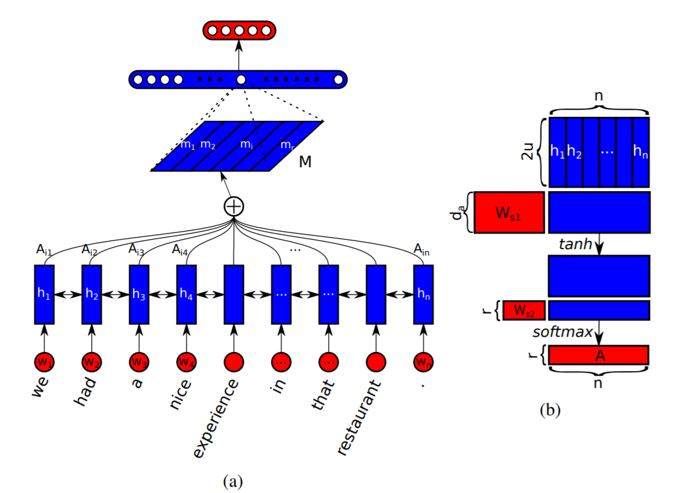
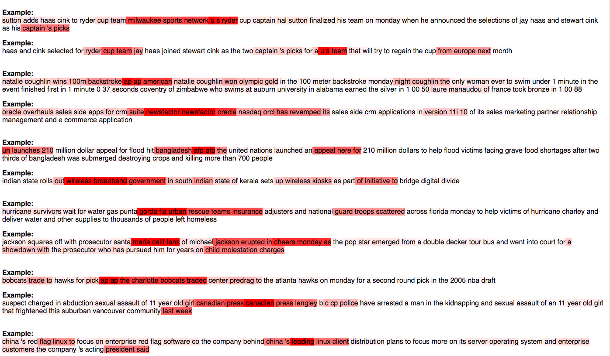

# Structured Self Attention - Tensorflow implementation
This repository contains the Tensorflow implementation for the paper [A Structured Self-Attentive Sentence Embedding](https://arxiv.org/abs/1703.03130) in tensorflow.  


## Dataset
- Binary classification on the IMDB Dataset from Keras   
- Multiclass classification on the AGNews Dataset

Using the pretrained glove embeddings (glove.6B.300d.txt). Download the Glove Embeddings from [here](http://nlp.stanford.edu/data/glove.6B.zip) and place it in the glove directory

## Implementation Details:
- Binary classification on IMDB Dataset and Muticlass classification on AGNews Dataset using self attention
- Regularization using Frobenius norm as described in the paper.
- Model parameters are defined in `model_params.json` and configuration parameters in `config.json`.

## Requirements:
- Python 3.6  
- Tensorflow 1.4.1  
- Keras 2.0.8  
- numpy 1.9.1  
- scipy 0.14  

## Execution  
```
python train.py
```
## Results
Test Accuracy: 89.3%


